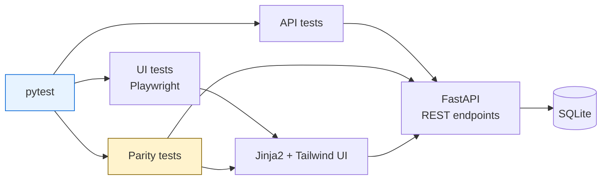

[](https://github.com/arpittomar246/commission-test-framework/actions)

# Commission Portal — app + test framework

A small insurance-commission portal (FastAPI + SQLAlchemy + Jinja2 + Tailwind)
and the automation framework built to test it: an API client, JSON Schema
contracts, Playwright page objects, and pytest fixtures.

Tests are written across three layers: **API** (pytest + requests), **UI**
(Playwright driving Chromium), and **parity** checks that verify both layers
agree on the same number. They are being added incrementally — run
`pytest --collect-only -q` for the current count.

## Architecture



The parity layer is the point of the project. It creates state through one path
and verifies it through the other — cancelling a policy in the browser, then
asserting the API reflects the clawback and the guarantee floor still holds.
Two routes to the same number, and they have to agree.

## Quick start

```bash
pip install -r requirements.txt
python -m playwright install chromium
python -m app.seed
python -m uvicorn app.main:app --reload
```

The portal is then at <http://127.0.0.1:8000>.

```bash
pytest -m api
```

## The rules

| Rule | Behaviour |
| --- | --- |
| Commission | 10% of a policy's value |
| Minimum guarantee | At least 20,000 per month for the first 3 calendar months from `join_date` |
| Clawback | Cancelling reverses the commission **in the month the policy was sold** |
| Guarantee floor | A clawback can never drag the payout below the guarantee while it applies |

The guarantee covers the join month and the two months after it — month 0, 1 and
2. It lapses from month 3.

Two decisions worth knowing, since neither was pinned down in the spec:

- **Outside the guarantee window a payout floors at zero.** If clawbacks exceed
  a month's gross, the agent is paid nothing rather than owing money back.
- **`guarantee_applied` means the guarantee actually changed the number.** A
  month inside the window that earns 25,000 reports `false`; one that earns
  9,000 and is topped up to 20,000 reports `true`. Earning exactly 20,000
  reports `false` — it was earned, not guaranteed.

All of it lives in [`app/commission.py`](app/commission.py) as pure functions
with no database, network or clock access, so the rules can be exercised
directly as well as over HTTP.

## API

| Method | Path | Notes |
| --- | --- | --- |
| `POST` | `/api/agents` | 201; 400 invalid, 409 duplicate email |
| `GET` | `/api/agents` | list |
| `GET` | `/api/agents/{id}` | 200 / 404 |
| `POST` | `/api/policies` | 201; 400 `value <= 0`, 404 unknown agent |
| `GET` | `/api/policies` | supports `?agent_id=` and `?status=` |
| `POST` | `/api/policies/{id}/cancel` | 200; 409 if already cancelled |
| `GET` | `/api/agents/{id}/commission?month=YYYY-MM` | the breakdown |
| `GET` | `/api/agents/{id}/commission/history?month=YYYY-MM` | six months, for the chart |
| `GET` | `/api/stats` | dashboard headline numbers |

Every failure returns the same shape, with the status the table promises:

```json
{ "detail": "value must be greater than zero", "code": "INVALID_VALUE" }
```

Codes in use: `VALIDATION_ERROR`, `INVALID_VALUE`, `INVALID_NAME`,
`INVALID_EMAIL`, `INVALID_CUSTOMER`, `INVALID_MONTH`, `INVALID_STATUS`,
`AGENT_NOT_FOUND`, `POLICY_NOT_FOUND`, `DUPLICATE_EMAIL`, `ALREADY_CANCELLED`.

Note that malformed payloads come back as **400**, not FastAPI's default 422 —
a handler rewrites them so the error contract holds everywhere.

## Layout

```
app/
  commission.py        the rules, pure functions
  main.py              routes, error handling, page rendering
  models.py            SQLAlchemy models
  schemas.py           Pydantic request/response models
  database.py          engine and session
  seed.py              5 agents, 20 policies
  templates/           base + dashboard, agents, policies, commission
  static/app.js        toasts, modals, fetch helpers
framework/
  config.py            BASE_URL, API_URL, TIMEOUT, HEADLESS from the environment
  api_client.py        requests.Session wrapper, one method per endpoint
  schemas/             JSON Schemas + validate_schema()
pages/
  base_page.py         goto, wait_for_testid, click_testid, fill_testid, ...
  agents_page.py       locators and actions, no assertions
  policies_page.py
  commission_page.py
tests/
  api/  ui/  parity/   the three test layers
```

## Writing the tests

### Fixtures

| Fixture | Scope | What it gives you |
| --- | --- | --- |
| `api_client` | session | `ApiClient` — one method per endpoint |
| `app_config` | session | the resolved `Config` |
| `agent_factory` | function | `agent_factory(name=..., join_date=...)`, cleaned up after |
| `new_agent` | function | one agent who joined today |
| `policy_factory` | function | `policy_factory(agent_id, value=..., sold_date=..., cancelled=...)` |
| `reset_db` | function | empties both tables before and after — mark those tests `serial` |
| `agents_page` / `policies_page` / `commission_page` | function | page objects, already open |
| `page`, `browser`, `context` | | from `pytest-playwright`, configured from the environment |

Factories create rows through the public API and clean up by deleting straight
from SQLite, since the API exposes no destructive endpoints.

### Test hooks

Every interactive element carries a `data-testid`. Nothing in the page objects
keys off a CSS class or visible text.

State is exposed as data attributes rather than as text or colour, so
assertions do not depend on wording:

| Attribute | Values |
| --- | --- |
| `data-status` on a policy badge | `active`, `cancelled` |
| `data-guarantee` on an agent badge | `active`, `expired` |
| `data-open` on a modal | `true`, `false` |
| `data-months` / `data-payouts` on the chart canvas | the JSON the chart was drawn with |

Table cells live under a `-cell-` namespace — `agent-cell-name-{id}`,
`policy-cell-value-{id}` — deliberately, so that a prefix query like
`[data-testid^="agent-cell-name-"]` matches table cells only and never picks up
the modal's `agent-name-input` or `agent-name-error`.

Money is rendered with `en-IN` grouping, so 301000 displays as `3,01,000.00`.
Compare numbers, not strings: `CommissionPage.as_number()` strips the
formatting for you.

### Markers

`api`, `ui`, `parity`, `smoke`, and `serial` for tests that mutate shared state
and must not run under `pytest -n`.

```bash
pytest -m smoke
pytest -m "ui or parity"
pytest -m api -n auto --dist loadfile
```

### Configuration

| Variable | Default |
| --- | --- |
| `BASE_URL` | `http://127.0.0.1:8000` |
| `API_URL` | `$BASE_URL/api` |
| `TIMEOUT` | `10` (seconds) |
| `HEADLESS` | `true` |
| `SLOW_MO` | `0` (milliseconds, for watching a run) |
| `BROWSER_CHANNEL` | unset — Playwright's bundled build; `chrome` uses the installed browser |
| `DB_PATH` | `./commission.db` |

If the bundled Chromium refuses to start — on Windows this surfaces as
`side-by-side configuration is incorrect` — set `BROWSER_CHANNEL=chrome` to run
against the Chrome already on the machine instead.

## Parallel execution

<!-- fill these in from a real run:
       pytest            -> serial
       pytest -n 4       -> parallel
-->

| Mode | Time |
| --- | --- |
| Serial | _TBD_ |
| Parallel (`-n 4`) | _TBD_ |

## Docker

```bash
docker compose up -d --wait
docker compose run --rm seed
```

The image carries the app only — no browsers — so tests run against it from the
host or from CI.

## CI

[`.github/workflows/ci.yml`](.github/workflows/ci.yml) installs dependencies and
Chromium, seeds the database, starts the app, and runs the API and UI suites as
two parallel jobs with `pytest-xdist`. Allure and JUnit results are uploaded as
artifacts, and a final job prints the README badge snippet for the repository.
